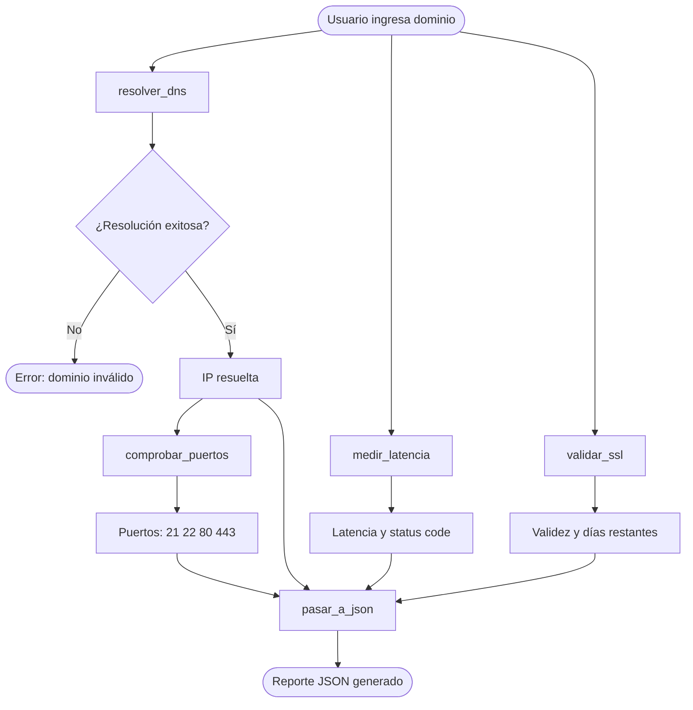

# Network Diagnostic Tool

Script Python que dado un dominio realiza un diagnóstico completo de red: resolución DNS, comprobación de puertos, medición de latencia HTTP y validación de certificado SSL. El resultado se exporta en formato JSON.

## Requisitos

- Python 3.x
- Librería `requests`

```bash
pip install requests
```

## Uso

```bash
python red.py
```

El script solicita un dominio por input:

```
ingrese un dominio: google.com
```

## Ejemplo de output

```json
{
    "dominio": "google.com",
    "ip": "142.250.80.46",
    "puertos": {
        "21": "cerrado",
        "22": "cerrado",
        "80": "abierto",
        "443": "abierto"
    },
    "latencia": {
        "status_code": 200,
        "latencia": 0.23
    },
    "ssl": {
        "valido": true,
        "proximo a vencer": false
    }
}
```

## Funciones

| Función | Descripción | Retorna |
|---|---|---|
| `resolver_dns(dominio)` | Resuelve el dominio a IP | `str` IP o `None` |
| `comprobar_puertos(ip)` | Escanea puertos 21, 22, 80, 443 | `dict` estado por puerto |
| `medir_latencia(dominio)` | Mide latencia HTTP y obtiene status code | `dict` latencia y status |
| `validar_ssl(dominio)` | Valida certificado SSL y días restantes | `dict` validez y proximidad |
| `pasar_a_json(...)` | Arma y exporta el reporte completo en JSON | `dict` reporte completo |

## Estructura del proyecto

```
proyecto red python/
├── red.py
└── docs/
    ├── Boceto del script.excalidraw
    └── Boceto del script.png
```

## Flujo del script



## Autor

Valentin Nestor Pagura — [@valentinpagura](https://github.com/valentinpagura)
